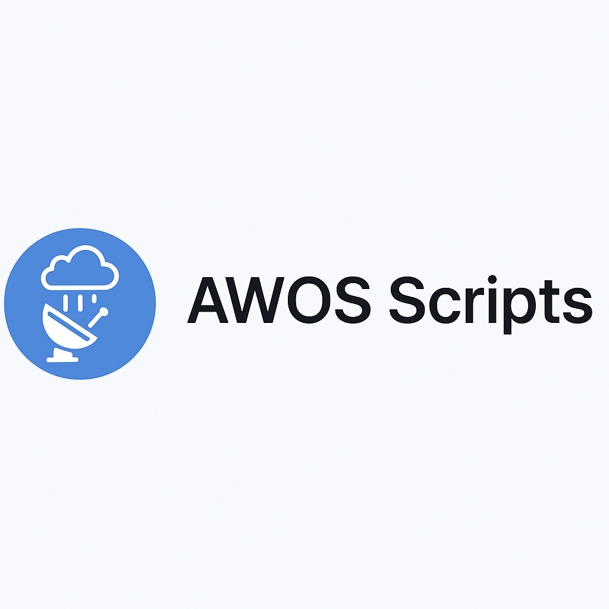

# 🛰️ AWOS Scripts

Custom userscripts for automating and enhancing the AWOS (Automated Weather Observing System) interface using the Violentmonkey extension.

These scripts run locally in your browser and inject functionality via DOM manipulation, mutation observers, and shared utilities. They do **not** modify AWOS source code directly.

---

## 📦 Script Overview

### ✅ Active Scripts
| Script                                                   | Description                                                                               |
|----------------------------------------------------------|-------------------------------------------------------------------------------------------|
| `CFWOS AWOS Core 4.1.user.js`                            | Main automation logic. Handles DOM mutations, triggers actions, and coordinates behavior. |
| `CFWOS AWOS Logger Utility.user.js`                      | Centralized logging utility for consistent console output.                                |
| `CFWOS AWOS Layout Enhancer 2.0.user.js`                 | Improves AWOS report layout with enhanced styling.                                        |
| `CFWOS AWOS Cleanup Suite 2.0.user.js`                   | Removes clutter, legacy configs, and hidden elements.                                     |
| `AWOS Floating Panel 3.5.1 (CLD Detail styling).user.js` | Adds a floating panel to the CLD Detail page.                                             |

### 🧪 In Development
| Script           | Description                                               |
|------------------|-----------------------------------------------------------|
| `awos-style.js`  | Injects custom CSS for readability and layout tweaks.     |
| `awos-utils.js`  | Shared helper functions (selectors, timers, etc.).        |
| `awos-config.js` | Optional config file for toggling features or thresholds. |

### 🗃️ Archived / Legacy
| Script                                         | Description                                 |
|------------------------------------------------|---------------------------------------------|
| `AWOS Mutation Observer Core 1.9.user.js`      | Older core logic for DOM mutation handling. |
| `AWOS Layout Enhancer (Full Version).user.js`  | Original layout enhancement script.         |
| `AWOS Banner Refactor.user.js`                 | Reorganizes AWOS banner layout.             |
| `WET Plugin Override + Remote Logging.user.js` | Suppresses unused WET plugins.              |

---
## 🛠️ Installation Instructions

### 🔹 Standard Installation (Recommended)

1. 📥 Download the full [AWOS Scripts ZIP](https://github.com/Weedman4201985/AWOS-Scripts/archive/refs/heads/main.zip) from this repository.
2. 🌐 Install [Violentmonkey for Firefox](https://violentmonkey.github.io/)

   _Alternatively, if Firefox isn’t your browser of choice:_  
   • [Violentmonkey for Microsoft Edge](https://microsoftedge.microsoft.com/addons/detail/violentmonkey/eeagobfjdenkkddmbclomhiblgggliao?hl=en&gl=US)  
   • [MeddleMonkey for Mac/OSX](https://apps.apple.com/us/app/meddlemonkey/id1539631953?mt=12)

3. 🧩 Open the Violentmonkey/MeddleMonkey dashboard.
4. ⚙️ Click **Settings**.
5. 📂 Under **Backup and Maintenance**, click **Import Scripts**.
6. 📦 Select the downloaded ZIP file.
7. ✅ Click **"Import"** and wait for completion.
8. 🔄 Ensure each script is enabled.
9. 📑 Confirm scripts are in the recommended load order.
10. 🏁 Close the dashboard.

---

  
🧭 Alternative Installation Methods

### 🔸 Manual Script Import (Individual Files)

1. Download each script manually:
    - [CFWOS AWOS Cleanup Suite 2.0](https://github.com/Weedman4201985/AWOS-Scripts/blob/main/CFWOS%20AWOS%20Cleanup%20Suite%202.0.user.js)
    - [CFWOS AWOS Core 4.1](https://github.com/Weedman4201985/AWOS-Scripts/blob/main/CFWOS%20AWOS%20Core%204.1.user.js)
    - [CFWOS AWOS Layout Enhancer 2.0](https://github.com/Weedman4201985/AWOS-Scripts/blob/main/CFWOS%20AWOS%20Layout%20Enhancer%202.0.user.js)
    - [CFWOS AWOS Logger Utility](https://github.com/Weedman4201985/AWOS-Scripts/blob/main/CFWOS%20AWOS%20Logger%20Utility.user.js)
    - [AWOS Floating Panel 3.5.1 (CLD Detail styling)](https://github.com/Weedman4201985/AWOS-Scripts/blob/main/AWOS%20Floating%20Panel%203.5.1%20(CLD%20Detail%20styling).user.js)

2. Open the Violentmonkey/MeddleMonkey dashboard.
3. Drag each downloaded script into the dashboard window.
4. Click **"Import"** and wait for completion.
5. Confirm recommended load order.
6. Close the dashboard.

---

### 🔸 Manual Copy-Paste Method

1. Open the script file on GitHub and click **Raw**.
2. Copy the entire script content.
3. Open the Violentmonkey/MeddleMonkey dashboard.
4. Click **"+"** to create a new script.
5. Paste the script into the editor.
6. Click **"Save"** and wait for completion.
7. Confirm recommended load order.
8. Close the dashboard.

---

## 🔁 Recommended Load Order

To ensure dependencies are available before scripts that rely on them:

1. `CFWOS AWOS Logger Utility.user.js`
2. `CFWOS AWOS Core 4.1.user.js`
3. `CFWOS AWOS Cleanup Suite 2.0.user.js`
4. `CFWOS AWOS Layout Enhancer 2.0.user.js`
5. `AWOS Floating Panel 3.5.1 (CLD Detail styling).user.js`

---

## 🧠 Notes

- Scripts are injected locally via Violentmonkey and are not hosted externally.
- If your Firefox profile or extension is deleted, you can restore scripts by re-downloading them from this repo.
- All scripts are written in vanilla JavaScript and designed to be modular and maintainable.

---

## 📌 License

MIT License — feel free to use, modify, and share.

---

## 🙋‍♂️ Author

Created and maintained by **Chris**.  
Suggestions? Open an issue or submit a pull request.